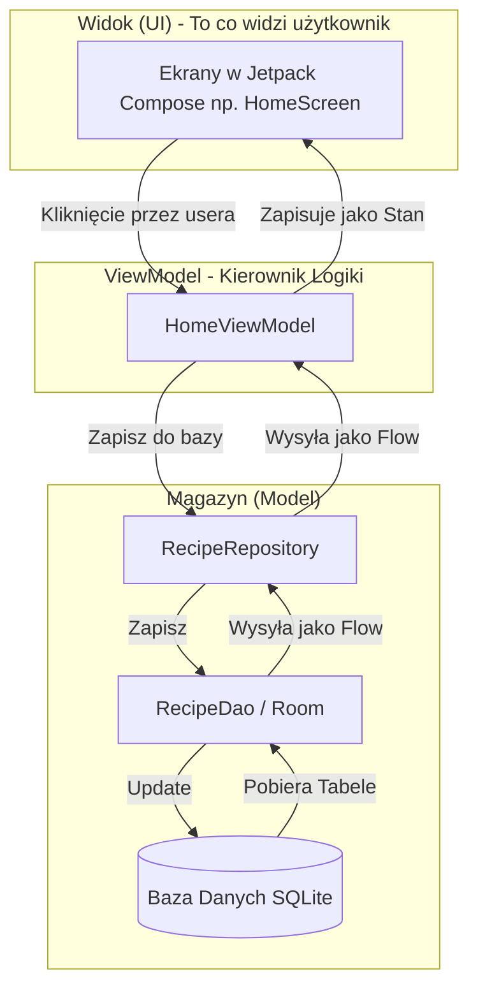

# 🍳 SmartCookBook (ScooBy 🐕)

> **Osobisty asystent kulinarny** — aplikacja mobilna na system Android umożliwiająca przeglądanie przepisów, zapisywanie ulubionych, zarządzanie listą zakupów oraz odmierzanie czasu gotowania.

---

## Spis treści

1. [Opis projektu](#opis-projektu)
2. [Technologie i biblioteki](#technologie-i-biblioteki)
3. [Architektura aplikacji](#architektura-aplikacji)
4. [Baza danych](#baza-danych)
5. [Ekrany i funkcjonalności](#ekrany-i-funkcjonalności)
6. [Nawigacja](#nawigacja)
7. [Obrazki i wideo](#obrazki-i-wideo)
8. [Uruchomienie projektu](#uruchomienie-projektu)
9. [Struktura projektu](#struktura-projektu)

---

## Opis projektu

SmartCookBook to aplikacja mobilna napisana w całości w języku **Kotlin** z wykorzystaniem **Jetpack Compose** jako frameworka do budowania interfejsu użytkownika. Aplikacja pozwala użytkownikowi na:

-  Przeglądanie przepisów kulinarnych pogrupowanych w kategorie
-  Wyszukiwanie przepisów po nazwie
-  Przeglądanie szczegółów przepisu (składniki, instrukcje krok po kroku, wideo)
-  Zapisywanie przepisów do ulubionych
-  Zarządzanie listą zakupów (dodawanie, zaznaczanie, usuwanie)
-  Odmierzanie czasu gotowania wbudowanym timerem
-  Automatyczne powitanie zależne od pory dnia

Dane przepisów są przechowywane **lokalnie** w bazie danych SQLite za pomocą biblioteki Room i wczytywane przy pierwszym uruchomieniu z predefiniowanego zestawu danych.

---

## Technologie i biblioteki

### Język i platforma

| Technologia | Wersja | Zastosowanie |
|---|---|---|
| **Kotlin** | 2.x | Główny język aplikacji |
| **Android SDK** | min 26 / target 35 | Platforma docelowa |
| **Jetpack Compose** | BOM 2025.01 | Deklaratywny framework UI |

### Zależności (plik `app/build.gradle.kts`)

| Biblioteka | Zastosowanie |
|---|---|
| **Material3** | Komponenty UI zgodne z Material Design 3 |
| **Navigation Compose** | Nawigacja między ekranami |
| **Room 2.6** | Lokalna baza danych SQLite z warstwą abstrakcji |
| **Coil 3** | Asynchroniczne ładowanie obrazków z URL z pamięcią podręczną |
| **Media3 ExoPlayer** | Odtwarzanie filmów wideo |
| **Kotlinx Coroutines** | Operacje asynchroniczne (IO, Main) |
| **KSP** | Procesor adnotacji — generuje kod DAO dla Room w czasie kompilacji |
| **Lifecycle ViewModel Compose** | Integracja ViewModel z Compose |

---

## Architektura aplikacji

Aplikacja jest zbudowana zgodnie z wzorcem architektonicznym **MVVM (Model – View – ViewModel)**, zalecanym przez Google dla aplikacji Android.



### Dlaczego MVVM?

- **ViewModel** przeżywa rotację ekranu — dane nie są tracone przy obrocie urządzenia
- **StateFlow** zapewnia reaktywność — UI automatycznie się aktualizuje gdy zmienią się dane w bazie
- **Repository** oddziela logikę dostępu do danych od logiki prezentacji — łatwość testowania i utrzymania

### Komponenty

| Warstwa | Klasy |
|---|---|
| **View** | `HomeScreen`, `RecipeDetailsScreen`, `FavoritesScreen`, `ShoppingListScreen`, `CookingTimerScreen`, `RecipeListScreen`, `WelcomeScreen` |
| **ViewModel** | `HomeViewModel`, `RecipeDetailsViewModel`, `FavoritesViewModel`, `ShoppingListViewModel`, `CookingTimerViewModel` |
| **Repository** | `RecipeRepository`, `ShoppingRepository` |
| **DAO** | `RecipeDao`, `FavoriteDao`, `ShoppingItemDao` |
| **Model** | `Category`, `Recipe`, `Ingredient`, `FavoriteEntity`, `ShoppingItemEntity` |

### Reprezentacja Stanu (StateFlow) w ViewModelach

Zgodnie z nowoczesnymi standardami Androida, każdy ekran posiada dedykowany ViewModel, który zarządza stanem i przekazuje go do widoku (UI) za pomocą asynchronicznych strumieni `StateFlow`. Poniżej zestawienie, co dokładnie jest "wypychane" przez poszczególne ViewModele na ekran:

| ViewModel | Wystawiane strumienie (StateFlow / Flow) | Co to daje i jak działa? | Co wyświetla na ekranie? |
|---|---|---|---|
| **HomeViewModel** | `allRecipes`, `categories`, `searchQuery`, `searchResults` | Przekazuje listę kategorii i przepisów. Najciekawszy jest `searchResults`, który używa operatora `combine` – w czasie rzeczywistym nasłuchuje tego co użytkownik wpisuje w `searchQuery` i natychmiast filtruje listę przepisów. | Lista kategorii, siatka z przepisami, pole wyszukiwania z odświeżanymi na żywo wynikami. |
| **FavoritesViewModel** | `favorites: StateFlow<List<Recipe>>` | Nasłuchuje na tabeli z Ulubionymi. Pobiera ID polubionych dań i automatycznie zaciąga pełne obiekty Przepisów z drugiej tabeli, podając gotową listę na ekran. | Lista ulubionych przepisów (LazyColumn). |
| **ShoppingListViewModel** | `items: StateFlow<List<ShoppingItemEntity>>` | Wypycha (emituje) pełną listę zakupów. Każde kliknięcie w checkbox od razu aktualizuje bazę, co sprawia, że Flow emituje nową listę, a ekran od razu przekreśla kupiony przedmiot. | Lista produktów z checkboxami i dynamiczny pasek postępu (Progress Bar). |
| **CookingTimerViewModel** | `timeLeftSeconds`, `isRunning`, `isFinished` | Odseparowany od bazy danych. Wewnątrz pętli korutyny (`delay(1000)`) co sekundę aktualizuje zmienną `timeLeftSeconds`, co wywołuje automatyczne odrysowanie malejącego kołowego paska postępu na ekranie. | Zmieniający się czas, animowany pasek postępu w formie koła (CircularProgressIndicator). |
| **RecipeDetailsViewModel**| `isFavorite: StateFlow<Boolean>` | Dla konkretnego otwartego przepisu sprawdza w tabeli, czy istnieje on w Ulubionych. Wypycha wynik Prawda/Fałsz, który decyduje, czy przycisk serduszka ma być pusty czy czerwony. | Ikona serduszka (pełna/pusta) na zdjęciu przepisu. |

---

## Baza danych

Aplikacja używa **Room Persistence Library** — warstwy abstrakcji nad SQLite dostarczonej przez Google w ramach Android Jetpack.

### Plik bazy danych

Baza danych jest przechowywana lokalnie na urządzeniu pod nazwą `smartcookbook_db`. Jej wersja jest zdefiniowana w klasie `AppDatabase`:

```
app/src/main/java/com/smartcookbook/data/local/AppDatabase.kt
```

### Schemat — 5 tabel

```sql
┌─────────────────────────────────────────────────────┐
│  KATEGORIE                                          │
│  id INTEGER PRIMARY KEY                             │
│  nazwa VARCHAR                                      │
│  obrazek_url VARCHAR                                │
└───────────────────┬─────────────────────────────────┘
                    │ 1:N
┌───────────────────▼─────────────────────────────────┐
│  PRZEPISY                                           │
│  id INTEGER PRIMARY KEY                             │
│  kategoria_id INTEGER  ──────► KATEGORIE.id         │
│  nazwa VARCHAR                                      │
│  czas_przygotowania VARCHAR                         │
│  instrukcje TEXT                                    │
│  obrazek_url VARCHAR                                │
│  wideo_url VARCHAR (nullable)                       │
└───────────────────┬─────────────────────────────────┘
                    │ 1:N
┌───────────────────▼─────────────────────────────────┐
│  SKLADNIKI                                          │
│  id INTEGER PRIMARY KEY AUTOINCREMENT               │
│  przepis_id INTEGER  ────────► PRZEPISY.id          │
│  nazwa VARCHAR                                      │
│  ilosc VARCHAR                                      │
└─────────────────────────────────────────────────────┘

┌─────────────────────────────────────────────────────┐
│  ULUBIONE                                           │
│  id INTEGER PRIMARY KEY AUTOINCREMENT               │
│  user_uid VARCHAR DEFAULT 'default_user'            │
│  przepis_id INTEGER                                 │
└─────────────────────────────────────────────────────┘

┌─────────────────────────────────────────────────────┐
│  LISTA_ZAKUPOW                                      │
│  id INTEGER PRIMARY KEY AUTOINCREMENT               │
│  user_uid VARCHAR DEFAULT 'default_user'            │
│  nazwa_produktu VARCHAR                             │
│  czy_kupione BOOLEAN DEFAULT 0                      │
└─────────────────────────────────────────────────────┘
```

### Klasy encji Room

| Plik | Tabela | Adnotacja Room |
|---|---|---|
| `Recipe.kt` | `Przepisy` | `@Entity(tableName = "Przepisy")` |
| `Recipe.kt` | `Kategorie` | `@Entity(tableName = "Kategorie")` |
| `Recipe.kt` | `Skladniki` | `@Entity(tableName = "Skladniki")` |
| `FavoriteEntity.kt` | `Ulubione` | `@Entity(tableName = "Ulubione")` |
| `ShoppingItemEntity.kt` | `Lista_Zakupow` | `@Entity(tableName = "Lista_Zakupow")` |

### Inicjalizacja bazy — wzorzec Singleton

```kotlin
// AppDatabase.kt
@Volatile private var INSTANCE: AppDatabase? = null

fun getInstance(context: Context): AppDatabase =
    INSTANCE ?: synchronized(this) {
        lateinit var db: AppDatabase
        db = Room.databaseBuilder(...)
            .fallbackToDestructiveMigration()
            .addCallback(SeedDataCallback(context) { db })
            .build()
        INSTANCE = db
        db
    }
```

Użycie `@Volatile` oraz bloku `synchronized` gwarantuje bezpieczeństwo wątkowe — baza jest tworzona dokładnie raz, nawet gdy wiele wątków wywołuje `getInstance` jednocześnie.

### Automatyczne wypełnianie danymi (SeedData)

Przy pierwszym uruchomieniu aplikacja automatycznie wypełnia bazę danych predefiniowanym zestawem 16 przepisów w 4 kategoriach. Dane startowe są zdefiniowane w:

```
app/src/main/java/com/smartcookbook/data/SeedData.kt
```

#### Mechanizm wersjonowania danych startowych

Zastosowany mechanizm jest bardziej zaawansowany niż prosta kontrola `COUNT(*) == 0`. Używa systemu wersjonowania przechowywanego w `SharedPreferences`:

```kotlin
// AppDatabase.kt
private const val SEED_DATA_VERSION = 4  // ← zwiększ przy każdej zmianie SeedData

override fun onOpen(db: SupportSQLiteDatabase) {
    CoroutineScope(Dispatchers.IO).launch {
        val prefs = context.getSharedPreferences(PREFS_NAME, Context.MODE_PRIVATE)
        val storedVersion = prefs.getInt(KEY_SEED_VERSION, 0)

        if (storedVersion != SEED_DATA_VERSION) {
            // Odśwież TYLKO dane przepisów — dane użytkownika pozostają nienaruszone
            dao.deleteAllIngredients()
            dao.deleteAllRecipes()
            dao.deleteAllCategories()
            dao.insertCategories(SeedData.CATEGORIES)
            dao.insertRecipes(SeedData.RECIPES)
            dao.insertIngredients(SeedData.INGREDIENTS)
            prefs.edit().putInt(KEY_SEED_VERSION, SEED_DATA_VERSION).apply()
        }
    }
}
```

**Kluczowa zaleta tego rozwiązania:** tabele `Ulubione` i `Lista_Zakupow` **nigdy nie są czyszczone** przy aktualizacji danych — dane użytkownika są zawsze bezpieczne. Jedyne co się zmienia to treść przepisów.

Aby zaktualizować dane startowe w przyszłości wystarczy:
1. Zmodyfikować `SeedData.kt`
2. Zwiększyć stałą `SEED_DATA_VERSION` o 1

### DAO — interfejsy dostępu do danych

Room generuje implementacje DAO automatycznie na podstawie adnotacji (`@Query`, `@Insert`, `@Delete`).

**`RecipeDao.kt`** — operacje na przepisach, kategoriach i składnikach:
```kotlin
@Query("SELECT * FROM Przepisy") fun getAllRecipes(): Flow<List<Recipe>>
@Query("SELECT * FROM Przepisy WHERE kategoria_id = :categoryId") fun getRecipesByCategory(...)
@Query("SELECT * FROM Przepisy WHERE id = :id") suspend fun getRecipeById(id: Int): Recipe?
@Query("SELECT COUNT(*) FROM Przepisy") suspend fun getRecipeCount(): Int
@Query("DELETE FROM Przepisy") suspend fun deleteAllRecipes()
@Insert(onConflict = OnConflictStrategy.REPLACE) suspend fun insertRecipes(...)
```

**`FavoriteDao.kt`** — operacje na ulubionych:
```kotlin
@Query("SELECT * FROM Ulubione") fun getAllFavorites(): Flow<List<FavoriteEntity>>
@Query("SELECT COUNT(*) > 0 FROM Ulubione WHERE przepis_id = :recipeId") fun isFavorite(...): Flow<Boolean>
@Insert suspend fun addFavorite(favorite: FavoriteEntity)
@Delete suspend fun removeFavorite(favorite: FavoriteEntity)
```

**`ShoppingItemDao.kt`** — operacje na liście zakupów:
```kotlin
@Query("SELECT * FROM Lista_Zakupow ORDER BY id ASC") fun getAllItems(): Flow<List<ShoppingItemEntity>>
@Insert suspend fun insertItem(item: ShoppingItemEntity)
@Update suspend fun updateItem(item: ShoppingItemEntity)
@Delete suspend fun deleteItem(item: ShoppingItemEntity)
@Query("DELETE FROM Lista_Zakupow WHERE czy_kupione = 1") suspend fun deleteCheckedItems()
```

### Reaktywność — Flow i StateFlow

Metody DAO zwracające `Flow<List<...>>` tworzą **reaktywne strumienie danych** — Room automatycznie emituje nową listę za każdym razem, gdy zawartość tabeli się zmieni. Nie trzeba ręcznie odpytywać bazy.

```kotlin
// HomeViewModel.kt
val allRecipes: StateFlow<List<Recipe>> = repo.getAllRecipes()
    .stateIn(
        scope = viewModelScope,                         // zakres życia (z ViewModel)
        started = SharingStarted.WhileSubscribed(5000), // aktywny gdy UI jest widoczne
        initialValue = emptyList()                      // wartość przed pierwszą emisją
    )
```

```kotlin
// HomeScreen.kt
val allRecipes by vm.allRecipes.collectAsState()
// UI automatycznie rerenderuje się przy każdej zmianie listy
```

### Migracje bazy

Wersja bazy (`version = 5`) jest synchronizowana z wersją schematu. Przy zmianie schematu (dodanie kolumny, nowa tabela) należy:

1. Podnieść `version` w `@Database`
2. Dodać klasę migracji LUB pozostawić `fallbackToDestructiveMigration()` (usuwa i odtwarza bazę)

`fallbackToDestructiveMigration()` jest akceptowalnym rozwiązaniem w fazie developmentu — dane przepisów są zawsze odtwarzane przez `SeedDataCallback`.

---

## Ekrany i funkcjonalności

### 1. WelcomeScreen — ekran powitalny

**Plik:** `ui/screens/WelcomeScreen.kt`

Ekran wyświetlany przy pierwszym uruchomieniu. Zawiera:
- Animowaną ikonę z efektem pulsowania (`rememberInfiniteTransition` → skala 1.0 → 1.06 → 1.0)
- Animację wejścia elementów (przesunięcie + przeźroczystość uruchamiane przez `LaunchedEffect`)
- Przycisk **"Get Started →"** nawigujący do ekranu głównego

Po kliknięciu: nawigacja do Home z `popUpTo(Welcome) { inclusive = true }` — uniemożliwia powrót do ekranu powitalnego przyciskiem "Wstecz".

---

### 2. HomeScreen — ekran główny

**Plik:** `ui/screens/HomeScreen.kt`  
**ViewModel:** `viewmodel/HomeViewModel.kt`

Zawiera następujące sekcje w pionowym `LazyColumn`:

**Dynamiczne powitanie** — zmienia się w zależności od pory dnia:
```kotlin
val greeting = when (hour) {
    in 0..11  -> "Good Morning!"
    in 12..16 -> "Good Afternoon!"
    else      -> "Good Evening!"
}
```

**Wyszukiwarka** — `OutlinedTextField` powiązany z `vm.searchQuery`. Operator `combine` łączy zapytanie z listą przepisów w czasie rzeczywistym:
```kotlin
val searchResults = combine(searchQuery, allRecipes) { query, recipes ->
    if (query.isBlank()) emptyList()
    else recipes.filter { it.title.contains(query, ignoreCase = true) }
}
```

**Recipe of the Day** — pierwszy przepis z bazy, duża karta z gradientem nałożonym na zdjęcie (`Brush.verticalGradient`).

**Categories** — siatka 2×2 kategorii. Implementacja: `categories.chunked(2)` dzieli listę na pary, każda para to `Row`.

**Popular Recipes** — poziomy przewijalny `LazyRow` z ostatnio oglądanymi przepisami. Strzałki nawigacyjne używają `listState.animateScrollToItem()` z płynną animacją. Pasek postępu odzwierciedla aktualną pozycję scrolla.

---

### 3. RecipeListScreen — lista przepisów kategorii

**Plik:** `ui/screens/RecipeListScreen.kt`

Wyświetla listę przepisów wybranej kategorii w pionowym `LazyColumn`. Bezpośrednio subskrybuje Flow z repozytorium — automatycznie odświeża się przy zmianach w bazie:

```kotlin
val recipes by recipeRepo.getRecipesByCategory(categoryId).collectAsState(initial = emptyList())
```

---

### 4. RecipeDetailsScreen — szczegóły przepisu

**Plik:** `ui/screens/RecipeDetailsScreen.kt`  
**ViewModel:** `viewmodel/RecipeDetailsViewModel.kt`

Najbardziej rozbudowany ekran. Składa się z:

**Sekcja hero (górne 280dp):**
- Domyślnie wyświetlane zdjęcie (`AsyncImage` z Coil) z gradientem i przyciskiem Play
- Po kliknięciu Play: `showVideo = true` → przełącza na `AndroidView { PlayerView }` z ExoPlayerem
- Przycisk serca — `vm.toggleFavorite()` → zapis/usunięcie z tabeli `Ulubione`

**Biała karta (content sheet):**
- Nachodzi na zdjęcie o 24dp (`offset(-24.dp)`) z zaokrąglonymi górnymi narożnikami
- Scrollowalna (`verticalScroll(rememberScrollState())`)

**Zakładki (TabRow):**
- **Ingredients** — lista składników z bazy. Każdy ma przycisk „+" dodający składnik do `Lista_Zakupow`. Lokalny `mutableStateSetOf` śledzi które składniki zostały już dodane w tej sesji (zmiana ikony na ✓)
- **Instructions** — kroki gotowania. Instrukcje są podzielone po `\n` i wyświetlane jako numerowana lista: `currentRecipe.instructions.split("\n")`

**FAB Timer** — `FloatingActionButton` w prawym dolnym rogu nawigujący do ekranu timera.

---

### 5. FavoritesScreen — ulubione

**Plik:** `ui/screens/FavoritesScreen.kt`  
**ViewModel:** `viewmodel/FavoritesViewModel.kt`

`LazyColumn` z przepisami zapisanymi w tabeli `Ulubione`. Dane pobierane reaktywnie:

```kotlin
// RecipeRepository.kt
fun getFavoriteRecipes(): Flow<List<Recipe>> =
    favoriteDao.getAllFavorites().flatMapLatest { entities ->
        val ids = entities.map { it.recipeId }
        if (ids.isEmpty()) flowOf(emptyList())
        else recipeDao.getRecipesByIds(ids)
    }
```

`flatMapLatest` — gdy lista ulubionych się zmieni, automatycznie uruchamiane jest nowe zapytanie o przepisy.

Gdy lista pusta — wyświetlany jest ekran zastępczy z ikoną serca i komunikatem.

---

### 6. ShoppingListScreen — lista zakupów

**Plik:** `ui/screens/ShoppingListScreen.kt`  
**ViewModel:** `viewmodel/ShoppingListViewModel.kt`

Funkcjonalności:
- **Dodawanie** — `OutlinedTextField` + przycisk Add → `vm.addItem(name)`
- **Zaznaczanie** — `Checkbox` → `vm.toggleItem(item)` → `dao.updateItem(item.copy(isChecked = !item.isChecked))`
- **Usuwanie** — przycisk Delete → `vm.removeItem(item)`
- **Pasek postępu** — `LinearProgressIndicator` z wartością `checkedCount / items.size`
- **Przekreślenie** — zaznaczone pozycje mają `TextDecoration.LineThrough`

Dane są **persystentne** — przeżywają restart aplikacji (przechowywane w Room).

---

### 7. CookingTimerScreen — timer kuchenny

**Plik:** `ui/screens/CookingTimerScreen.kt`  
**ViewModel:** `viewmodel/CookingTimerViewModel.kt`

Funkcjonalności:
- **Presety czasu:** 5, 10, 15, 20, 30 minut jako `FilterChip`
- **Ręczna regulacja:** przyciski +/- po 1 minucie
- **Odliczanie:** coroutine Job w `viewModelScope`:
  ```kotlin
  timerJob = viewModelScope.launch {
      while (_timeLeftSeconds.value > 0) {
          delay(1000L)
          _timeLeftSeconds.value -= 1
      }
      _isFinished.value = true
  }
  ```
- **Wizualizacja:** dwa nakładające się `CircularProgressIndicator` (tło szare + pomarańczowy postęp)
- **Dźwięk zakończenia:** `MediaPlayer` odtwarza zapętlony dźwięk alarmu (`timer_alarm.mp3`). Istnieje opcja wyłączenia zapętlonego dźwięku i zresetowania stopera po upłynięciu czasu za pomocą dedykowanego przycisku ("Stop Alarm").
- **Animacja "Done! ":** pulsujące `graphicsLayer { alpha = pulseAlpha }` przez `rememberInfiniteTransition`

---

## Nawigacja

Aplikacja używa **Navigation Compose** w architekturze Single Activity.

**Plik Screen.kt** definiuje 7 tras jako `sealed class`:

```kotlin
sealed class Screen(val route: String) {
    object Welcome      : Screen("welcome")
    object Home         : Screen("home")
    object RecipeList   : Screen("recipe_list/{categoryId}")
    object RecipeDetails: Screen("recipe_details/{recipeId}")
    object Favorites    : Screen("favorites")
    object ShoppingList : Screen("shopping_list")
    object CookingTimer : Screen("cooking_timer")
}
```

**NavGraph.kt** — centralny punkt aplikacji:
- Tworzy singleton bazy danych i obu repozytoriów (`remember { RecipeRepository(...) }`)
- Definiuje wszystkie trasy z `composable(...)`
- Parsuje parametry URL: `back.arguments?.getString("recipeId")?.toIntOrNull() ?: -1`
- Tworzy ViewModele przez własne `Factory` (konieczne, bo konstruktory przyjmują parametry)

---

## Obrazki i wideo

### Obrazki — Coil 3

Biblioteka **Coil** (`io.coil-kt.coil3:coil-compose`) ładuje obrazki z URL asynchronicznie:

```kotlin
AsyncImage(
    model = recipe.thumbnail,         // URL z bazy (Unsplash CDN)
    contentDescription = recipe.title,
    contentScale = ContentScale.Crop, // skalowanie + przycinanie do obszaru
    modifier = Modifier.fillMaxSize()
)
```

Coil automatycznie zarządza:
- Pamięcią podręczną w RAM (LRU cache)
- Pamięcią podręczną na dysku
- Ładowaniem w tle (Dispatchers.IO)
- Zwalnianiem zasobów

Singleton Coil jest konfigurowany w klasie `SmartCookBookApp` (klasa Application).

### Wideo — Media3 ExoPlayer

**ExoPlayer** (`androidx.media3:media3-exoplayer`) odtwarza filmy z URL:

```kotlin
// Tworzenie playera — tylko gdy przepis ma videoUrl
val exoPlayer = remember(currentRecipe.videoUrl) {
    if (currentRecipe.videoUrl != null) {
        ExoPlayer.Builder(context).build().apply {
            setMediaItem(MediaItem.fromUri(currentRecipe.videoUrl))
            prepare()  // inicjuje buforowanie w tle
        }
    } else null
}

// Zwolnienie zasobów przy opuszczeniu ekranu
DisposableEffect(exoPlayer) {
    onDispose { exoPlayer?.release() }
}
```

Wyświetlanie przez `AndroidView` — most między Compose a klasycznym widokiem Android (ExoPlayer wymaga `View`):

```kotlin
AndroidView(
    factory = { ctx ->
        PlayerView(ctx).apply {
            player = exoPlayer
            exoPlayer.playWhenReady = true
        }
    }
)
```

**`remember(currentRecipe.videoUrl)`** — player jest tworzony na nowo tylko gdy zmieni się URL przepisu. Efektywne zarządzanie zasobami.

**Linki do filmów:** przepisy używają publicznych plików testowych z oficjalnego bucketa ExoPlayer (`storage.googleapis.com/exoplayer-test-media-0/`), gwarantowanych przez Google.

---

## Uruchomienie projektu

### Wymagania

- **Android Studio** Hedgehog (2023.1) lub nowszy
- **JDK 17**
- **Android SDK** z API Level 26+
- Połączenie z internetem (do ładowania obrazków i filmów)

### Kroki

```bash
# 1. Sklonuj repozytorium
git clone https://github.com/MikoMatusIndustry/SmartCookBook.git
cd SmartCookBook

# 2. Przełącz na gałąź z integracją bazy danych
git checkout database_integration
```

1. Otwórz projekt w **Android Studio**
2. Poczekaj na zakończenie synchronizacji Gradle (**File → Sync Project with Gradle Files**)
3. Podłącz urządzenie fizyczne lub uruchom emulator (API 26+)
4. Kliknij **▶ Run 'app'** lub naciśnij `Shift + F10`

> **Pierwsze uruchomienie:** aplikacja automatycznie wypełni bazę danych 16 przepisami w 4 kategoriach. Nie jest wymagana żadna dodatkowa konfiguracja.

### Gałęzie

| Gałąź | Opis |
|---|---|
| `main` | Wersja bazowa projektu |
| `database_integration` | Aktualna wersja z pełną integracją Room |

---

## Struktura projektu

```
app/src/main/
├── AndroidManifest.xml                    ← uprawnienia (INTERNET), rejestracja App class
└── java/com/smartcookbook/
    │
    ├── MainActivity.kt                    ← jedyna Activity; enableEdgeToEdge + NavGraph
    ├── SmartCookBookApp.kt                ← klasa Application; konfiguracja Coil (singleton)
    │
    ├── data/
    │   ├── SeedData.kt                    ← 4 kategorie, 16 przepisów, ~100 składników
    │   │
    │   ├── local/                         ← warstwa Room
    │   │   ├── AppDatabase.kt             ← definicja bazy, wersja, SeedDataCallback
    │   │   ├── RecipeDao.kt               ← SQL: Kategorie, Przepisy, Składniki
    │   │   ├── FavoriteDao.kt             ← SQL: Ulubione
    │   │   ├── ShoppingItemDao.kt         ← SQL: Lista_Zakupow
    │   │   ├── FavoriteEntity.kt          ← @Entity dla tabeli Ulubione
    │   │   └── ShoppingItemEntity.kt      ← @Entity dla tabeli Lista_Zakupow
    │   │
    │   ├── model/
    │   │   └── Recipe.kt                  ← @Entity: Category, Recipe, Ingredient
    │   │
    │   └── repository/
    │       ├── RecipeRepository.kt        ← przepisy + ulubione + ostatnio oglądane
    │       └── ShoppingRepository.kt      ← lista zakupów
    │
    ├── viewmodel/
    │   ├── HomeViewModel.kt               ← stan HomeScreen; wyszukiwanie, kategorie
    │   ├── RecipeDetailsViewModel.kt      ← stan szczegółów; ulubione
    │   ├── FavoritesViewModel.kt          ← lista ulubionych
    │   ├── ShoppingListViewModel.kt       ← lista zakupów
    │   └── CookingTimerViewModel.kt       ← logika timera (coroutine Job)
    │
    └── ui/
        ├── theme/                         ← kolory, typografia, SmartCookBookTheme
        │
        ├── navigation/
        │   ├── Screen.kt                  ← sealed class z 7 trasami
        │   └── NavGraph.kt                ← NavHost, tworzenie repozytoriów i VM
        │
        ├── components/
        │   ├── RecipeCard.kt              ← karta przepisu (AsyncImage + tytuł + czas)
        │   └── BottomNavBar.kt            ← dolny pasek nawigacji (Home / Favorites / List)
        │
        └── screens/
            ├── WelcomeScreen.kt           ← ekran powitalny z animacjami
            ├── HomeScreen.kt              ← ekran główny (greeting, search, categories, recipes)
            ├── RecipeListScreen.kt        ← lista przepisów danej kategorii
            ├── RecipeDetailsScreen.kt     ← szczegóły + ExoPlayer + składniki + instrukcje
            ├── FavoritesScreen.kt         ← ulubione przepisy
            ├── ShoppingListScreen.kt      ← lista zakupów z progress barem
            └── CookingTimerScreen.kt      ← timer z animacją kołową i dźwiękiem
```

---

## Autorzy

Mikołaj Matusik 279526
Kajetan Dzik 279399

